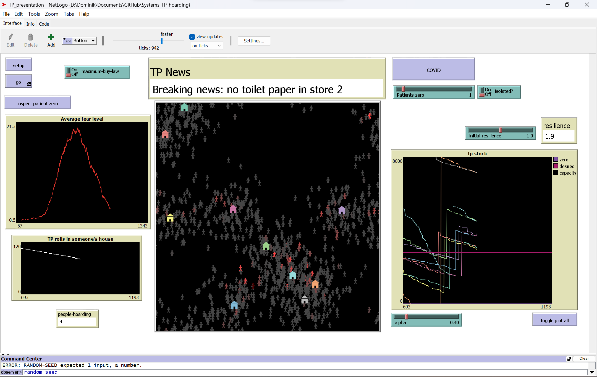
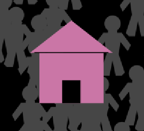

# Toilet paper hoarding in COVID-19

Group project for module "Systems - the science of everything" by:

Harry Byrne, Dominik Kuczynski, James Hales, Cormac Niland, Molly Robinson

## What does the model do?

This is a multi-agent model to simulate the spread of fear across a population resulting in
a mass hoarding event, similar to what happened with toilet paper during the COVID-19 pandemic.
The model consists of persons, who consume toilet paper ("TP"), buy it in stores and spread fear
and stores, that order new stock every month. The simulation also includes social media 
connections between the persons, as well as the influence of traditional media.

## Agents

The agents are as follows: 

-  **Persons**

Persons wander around their home location until they run out of toilet paper, in which case
they go to one of the three nearest stores to buy some. They can spread fear with their friends as
well as get scared by the traditional media (headlines).

-  **Stores**

Stores have a given amount of toilet paper in stock, and they order every month. They cannot
order more than 8000, and cannot go below 0. They are equipped with a simple learning algorithm,
to try to predict and counteract being out of stock, but they always undercompensate.

## Parameters

- `maximum-buy-law` &rarr; enabling this will limit each person's tp buying to 25 at a time
- `inspect patient zero` &rarr; shows the connections "friendships" of one of the most scared persons
- `COVID` &rarr; pressing will signicantly increase fear in a number of persons
- `patients-zero` &rarr; determines how many persons will be affected by `COVID`
- `isolated?` &rarr; determines whether the above mentioned persons will have few friends - be isolated
- `initial-resilience` &rarr; sets the initial resilience to fear of all the persons
- `alpha` &rarr; determines how much the stores "learn" from last month's sales: <1 means undercompensating, >1 means overcompensating

## Plots

- **Average fear level** &rarr; shows the average fear level among all persons
- **TP rolls in someone's house** &rarr; shows the amount of tp currently in the possession of some random person - notice they use it up slower when they have less
and buy whenever the amount drops below some minimum
- **tp stock** &rarr; shows the amount of tp in stock at each of the stores: the colour of the plot line corresponds with the store's color. Top border indicates
maximum capacity and bottom border is zero - sold out. "Toggle plot all" button allows to 
switch between plotting all stores and just one, selected by left clicking with the mouse.

## Using the model
Before starting the simulation, press the `setup` button to initialize the map and population.
You may, at this point, want to adjust some of the parameters to your liking, before running
the model.  
To start a mass fear event, choose the amount of `Patients-zero`, choose whether they should be
`isolated` or not, and press `COVID`. This will initially increase fear in the chosen number
of persons, potentially leading to viral spread.

You may now press `go` to start the simulation. Observe the **Average fear level** plot to see
how scared the population is and keep an eye on **tp stock** in the stores, to notice when mass
hoarding has lead to them going out of stock.

You may also test possible real-world solutions to mass hoarding. The first of these is a
`maximum-buy-law`, which limits the number of rolls that each person can buy at a time. This
usually prevents a large-scale shortage, but does not tend to influence the fear levels among
people. The second possible solution is changing the `initial-resilience` of the population
before starting the event. This may, generally speaking, correspond to education and experience
in the society. Try increasing it from 1 to 1.1 or higher and notice that both fear levels and 
the number of shortages are decreased. 