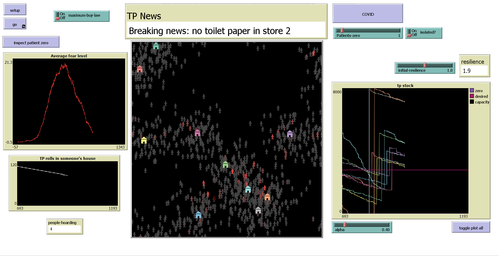

# Toilet paper hoarding in COVID-19

Group project for module "Systems - the science of everything" by:

Harry Byrne, Dominik Kuczynski, James Hales, Cormac Niland, Molly Robinson

## Documentation

### Agents

The agents are as follows: 

-  Persons

Persons wander around their home location until they run out of toilet paper, in which case
they go to one of the nearest stores to buy some. They can spread fear with their friends as
well as get scared by the media.

-  Stores

Stores have a given amount of toilet paper in stock, and they order every month. 

### Parameters

- `maximum-buy-law` -> enabling this will limit each person's tp buying to 25 at a time
- `inspect patient zero` -> shows the connections "friendships" of one of the most scared persons
- `COVID` -> pressing will signicantly increase fear in a number of persons
- `patients-zero` -> determines how many persons will be affected by `COVID`
- `isolated?` -> determines whether the above mentioned persons will have few friends - be isolated
- `initial-resilience` -> sets the initial resilience to fear of all the persons

### Running the model
